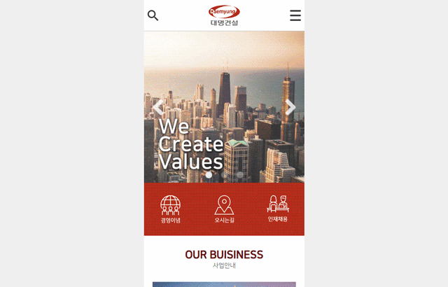
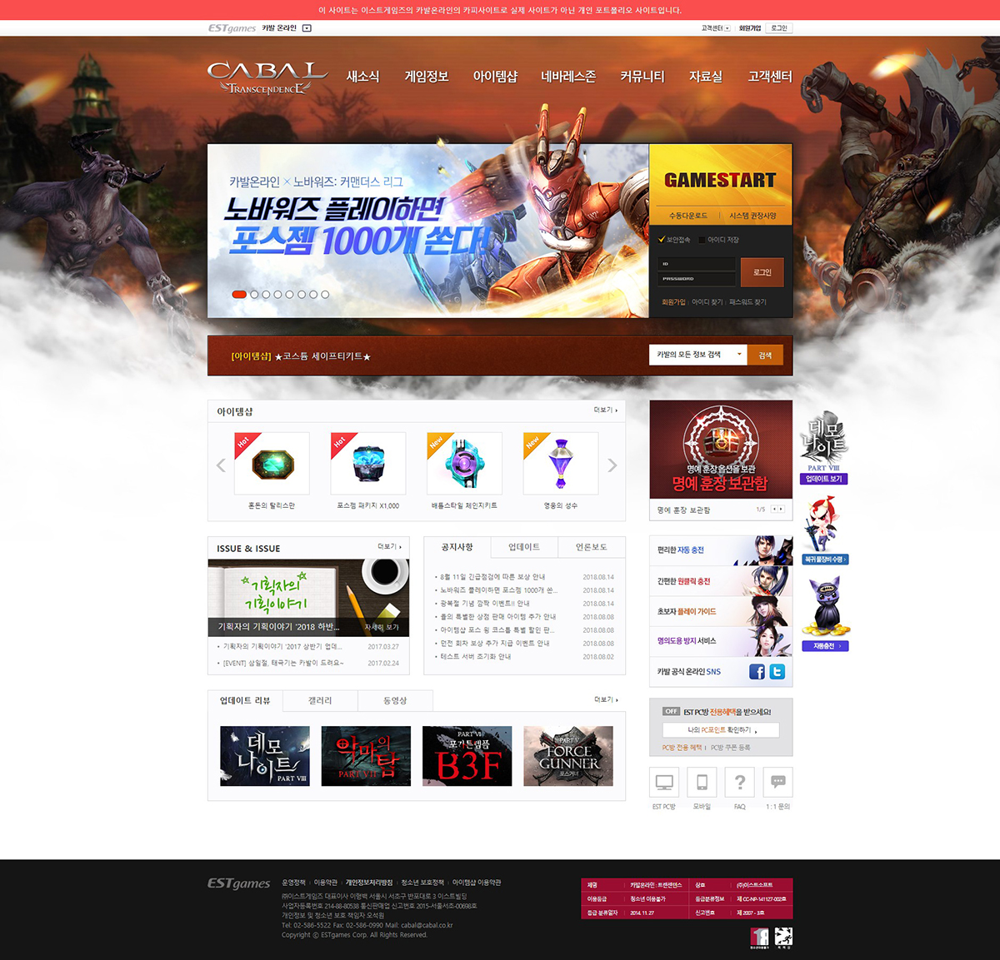
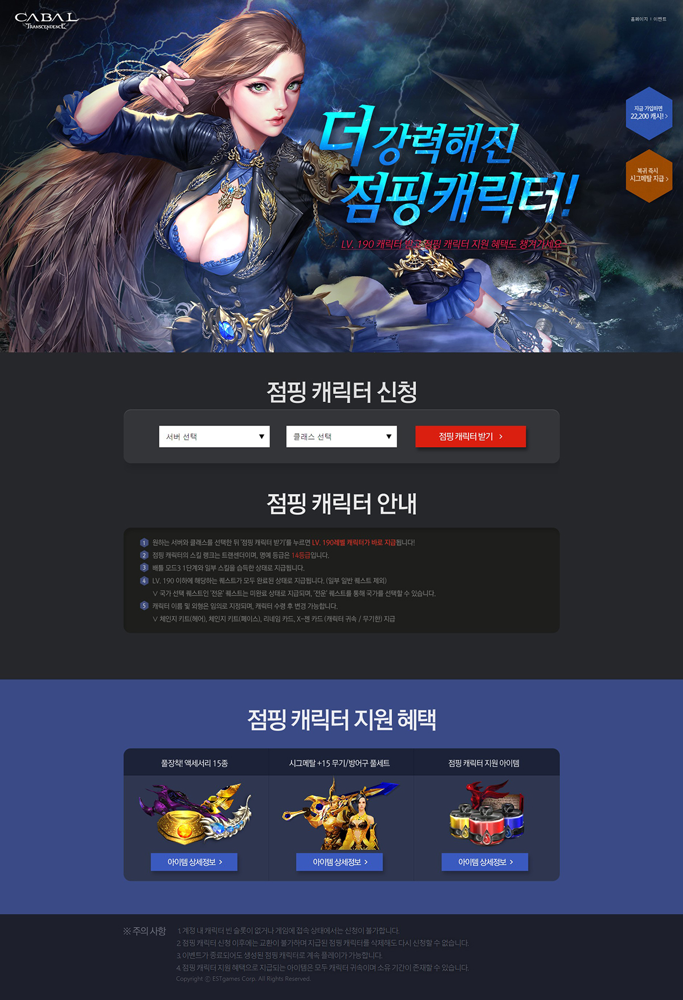

# 2018-2019 웹 퍼블리셔 포트폴리오

## 대명건설 RENEWAL
대명건설의 사이트를 리뉴얼(디자인, 퍼블리싱)한 작업물입니다.  

### 기업형 사이트 [작업물 바로가기](http://may54ther.cafe24.com/www)

### 모바일 사이트 [작업물 바로가기](http://may54ther.cafe24.com/mobile)

---
## 2. 엘리사브 (ELIE SAAB) RENEWAL [작업물 바로가기](https://may54ther.github.io/2018_portfolio/엘리사브/index.html)
외국 패션브랜드인 ELIE SAAB의 사이트를 리뉴얼(디자인, 퍼블리싱)한 작업물입니다.  

  
▲ 메인페이지 PC SIZE  

  
▲ 메인페이지 모바일 SIZE   

  
▲ 서브페이지 반응형  

- 특징
  - JSON 활용:  공지사항·업데이트·언론보드
  - 슬라이드 기능 구현
  
----  
## [카발온라인](http://www.cabal.co.kr/main) COPY 
이스트게임즈의 카발온라인 **카피**사이트 입니다.
### 카발온라인 - 메인 [바로가기](https://may54ther.github.io/2018_portfolio/카발온라인/main/index.html)
   
- 특징
  - JSON 활용:  공지사항·업데이트·언론보도 - 슬라이드 기능 구현  
### 카발온라인 - 이벤트 [바로가기](https://may54ther.github.io/2018_portfolio/카발온라인/event/index.html)  
 
 - 특징
    - IE7+ 크로스브라우징  
